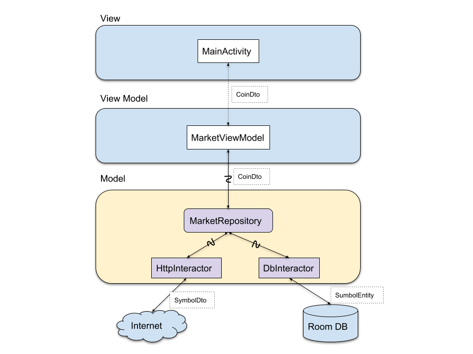
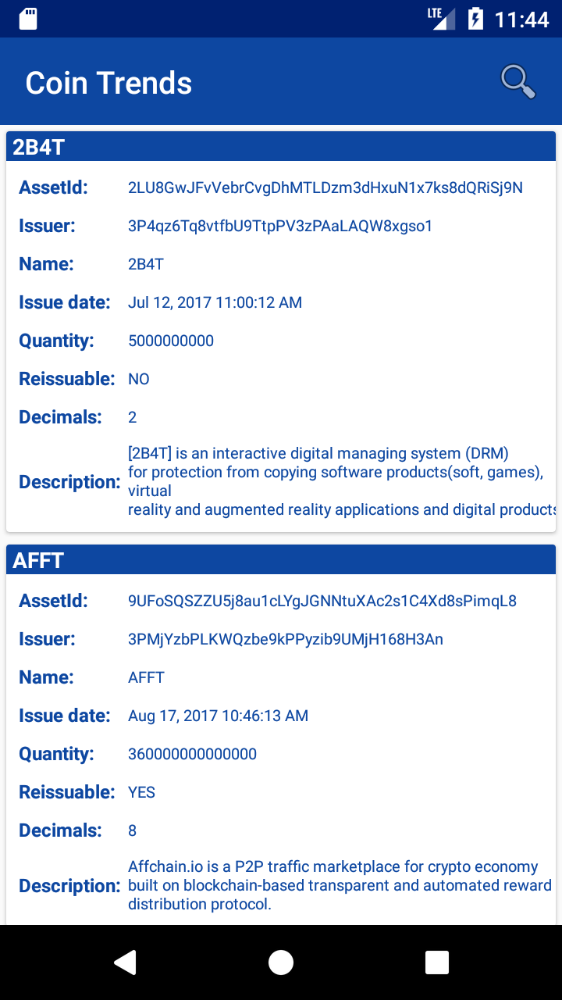

# Coin Trends
Coin Trends is showcase or blueprint Android project that is trying to leverage what MVVP architecture does in a more effective way using latest frameworks and technologies available. 

Next are used:

- Retrofit2
- Dagger2 
- Androidx packages (in place of appcomat)
- Room Database
- Kotlin coroutines

Before going deeper how everything works I would like to explain what Coin Trends app does. 'Coin' in the name is not for nothing because application gets information about all coins that are on trade at Wavesplatform's DEX (decentralized exchange). This exchange is chosen because they provide free REST API endpoints with no limits on usage. If you want to create similar  application that works with other exchange(s), you can achieve that relatively simply by changing exchange's specifics in the model layer. Since all data are static (at least in the current version),  room database is used for storing them for later use. Because the list of coins is very long (more than 200 entries), search view is added for easy navigation to desired coin. 

This project is created with the idea to be used as good practice guideline for projects that requires combination of external and intenal data. Any comment and/or contribution are welcome.
   
## Architecture



Application uses MVVM architectural pattern for layer separation. On the top is **View** layer where MainActivity resides. Activity class observes LiveData object that it gets from the **View Model** layer. ViewModel and **Model** layer are using Kotlin's coroutines to retrieve the data from DB/Internet. We can see that this pattern in combination with coroutines greatly simplifies implementation. All our asynchronous calls are called in synchronous manner which completely removes need for complex "observes" blocks or interface callbacks.

For example, HttpInteractor getDeatils suspended method look like this:

```kotlin
    suspend fun getDetails(assetId: String): DetailsDto? {
        var result: DetailsDto? = null

        try {
            val response = nodeHttpService.getDetailsForAsset(assetId).await()
            if (response.isSuccessful) {
                result = response.body()
            } else {
                Log.e("error", response.errorBody().toString())
            }
        } catch (e: Exception) {
            Log.e("exception occurred ", e.message)
        }

        return result
    }
```

It does look like normal method, but because **nodeHttpService.getDetailsForAsset(assetId)** returns **Deffered** object, than await() call gets executed without blocking a thread and resumes when deffered execution is complete (or throws corresponding exception in case of error).

For more about Kotlin coroutines check:

https://kotlinlang.org/docs/reference/coroutines-overview.html

## Screenshots 

   

Screenshots were taken from the app. Soon it will be available on Play Store.


## License

~~~
Copyright 2018 Nikola Šoljaga

Licensed under the Apache License, Version 2.0 (the "License");
you may not use this file except in compliance with the License.
You may obtain a copy of the License at

   http://www.apache.org/licenses/LICENSE-2.0

Unless required by applicable law or agreed to in writing, software
distributed under the License is distributed on an "AS IS" BASIS,
WITHOUT WARRANTIES OR CONDITIONS OF ANY KIND, either express or implied.
See the License for the specific language governing permissions and
limitations under the License.
~~~

